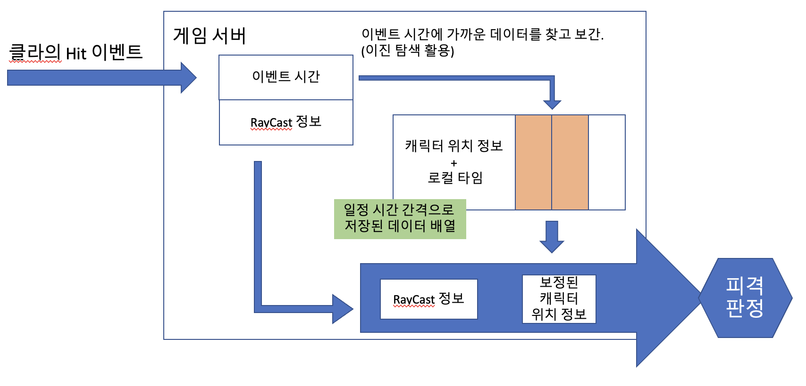

# LagCompenstation

* FPS 의 판정 보정 알고리즘을 R&D 하기위한 프로젝트

## FPS 판정 보정 간단한 설명. 

핑이 높은 경우 클라이언트가 타겟(적군)을 맞춰도 서버에서는 타겟이 피격 판정 범위를 벗어났기 때문에 피격이 되지 않는다.
이를 판정 보정을 통해 핑이 높은 클라이언트에서 피격이 가능하도록한 프로젝트.

### 동작 방식

이벤트를 받은 시간(서버 로컬타임)과 RTT(Round Trip Time) 를 통해 이벤트가 발생된 시간을 추측.
추측한 이벤트 발생 시간을 통해 당시 플레이어의 위치 정보(보정 위치)를 얻고 이 위치를 이용해 피격 판정을 다시한다.

언리얼 풀 소스코드의 엔진으로 ShooterGame 프로젝트를 생성후 코드를 덮어 씌워 동작시킬 수 있습니다.
